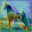
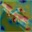
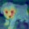
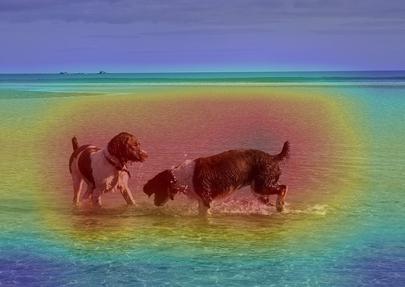
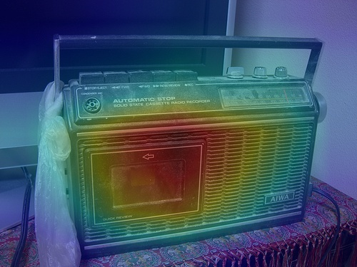
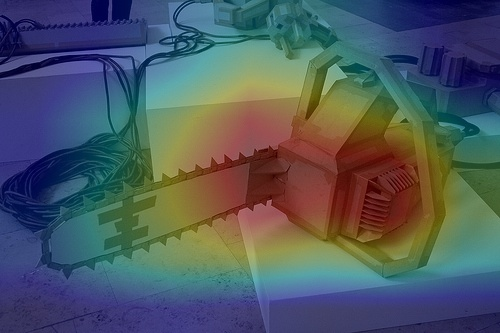

# Laboratory 1 CNNs

This repository contains deep learning experiments for fist CNN Laboratory

## Models

- **MLP:** Classic Multilayer Perceptron  
- **ResMLP:** Multilayer Perceptron with residual connections  
- **CNN:** Basic Convolutional Neural Network; internal blocks are similar to ResNet18 but without residuals  
- **ResCNN:** Convolutional Neural Network using ResNet18 core blocks with residual connections

## Datasets

Models are trained on two datasets:

- **MNIST:**  
  - Used for MLP and ResMLP  
  - [MNIST Dataset Documentation](https://docs.pytorch.org/vision/main/generated/torchvision.datasets.MNIST.html)
- **CIFAR10:**  
  - Used for CNN and ResCNN  
  - [CIFAR10 Dataset Documentation](https://docs.pytorch.org/vision/main/generated/torchvision.datasets.CIFAR10.html)

## Experiment Tracking with Weights & Biases

This project uses [Weights & Biases (W&B)](https://wandb.ai/) for tracking experiments and visualizing training metrics.
- [Lab1_experiments_MNIST Project](https://wandb.ai/lucacapece007-universit-di-firenze/Lab1_experiments_MNIST?nw=nwuserlucacapece007)  
- [Lab1_experiments_CIFAR10 Project](https://wandb.ai/lucacapece007-universit-di-firenze/Lab1_experiments_CIFAR10?nw=nwuserlucacapece007)  
- [Lab1_ResCNN_CAM Project](https://wandb.ai/lucacapece007-universit-di-firenze/Lab1_ResCNN_CAM?nw=nwuserlucacapece007)

### MLP vs ResMLP on MNIST

MLP and ResMLP are trained on MNIST at varying depths.  
Classic MLPs with increased depth suffer from **vanishing gradients**, resulting in poor accuracy.  
ResMLP solves this problem via residual connections, leading to better gradient flow and higher accuracy.
[](https://wandb.ai/lucacapece007-universit-di-firenze/Lab1_experiments_MNIST?nw=nwuserlucacapece007)

**Gradient Norm Comparisons (Depth 15):**  
  


Second Part compare *CNN* and *ResCNN* trained on MNIST at different net depths, in this case we can see how in mean ResCNN outperform the classical CNN
[](https://wandb.ai/lucacapece007-universit-di-firenze/Lab1_experiments_CIFAR10?nw=nwuserlucacapece007)

**CNN ResCNN boxplot comparison:** 


### Class Activation Maps (CAM)

Second part of the laboratory implement Class Activation map for both:
- [CIFAR10](https://docs.pytorch.org/vision/main/generated/torchvision.datasets.CIFAR10.html)
- [imaginette](https://docs.pytorch.org/vision/main/generated/torchvision.datasets.Imagenette.html)

CAM is implemented for interpretability — it highlights image regions that contribute most to model decisions.  
CAM calculates a weighted activation map from the final convolutional layer's feature maps using the fully connected layer weights.


The CNN used for CIFAR10 is the following one (ResCNN depth 5) 
[](https://wandb.ai/lucacapece007-universit-di-firenze/Lab1_ResCNN_CAM?nw=nwuserlucacapece007)

CAM is evaluated for both CIFAR10 and Imagenette datasets:

- **CIFAR10 CAM examples:**  
    
    
    
    
   

however CIFAR10 images have terrible resolution, for this reason same tecnique get used on the imaginette dataset

- **Imagenette CAM examples (using pretrained ResNet18):**  
    
    
    
    
  

## Installazione

1. Clone repository:

```
git clone https://github.com/lucrezio001/Deep-Leaning-Application-Luca-Capece.git
cd Deep-Leaning-Application-Luca-Capece/Lab1_CNN
```

2. Install dipendency:

```
pip install -r requirements.txt
```

## Bibliography

- He, K., Zhang, X., Ren, S., & Sun, J. (2015). Deep Residual Learning for Image Recognition. [arXiv:1512.03385](https://doi.org/10.48550/arXiv.1512.03385)  
- Zhou, B., Khosla, A., Lapedriza, A., Oliva, A., & Torralba, A. (2015). Learning Deep Features for Discriminative Localization. [arXiv:1512.04150](https://doi.org/10.48550/arXiv.1512.04150)

