```markdown
# Laboratory 4: Adversarial Learning and OOD Detection

## Models
- **ResCNN:** Residual Convolutional Neural Network based on ResNet18 blocks for robust image classification (same architecture as Lab1_CNN).
- **Autoencoder:** Unsupervised model used for Out-Of-Distribution (OOD) detection.

## Datasets
- [**CIFAR10**](https://docs.pytorch.org/vision/main/generated/torchvision.datasets.CIFAR10.html): Main training and evaluation dataset for all supervised and unsupervised experiments.
- [**FakeData**](https://docs.pytorch.org/vision/main/generated/torchvision.datasets.FakeData.html): Synthetic unlabeled data for OOD detection demonstration.

## Pipeline Overview

### 1. OOD Detection and Performance Evaluation Using CNN
- **Confusion Matrix** on CIFAR10:  
  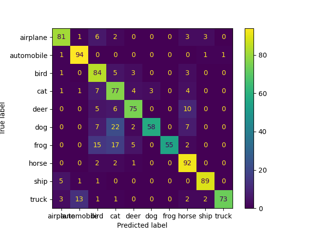

- **Model Predictions on CIFAR10 Sample:**  
  Image: 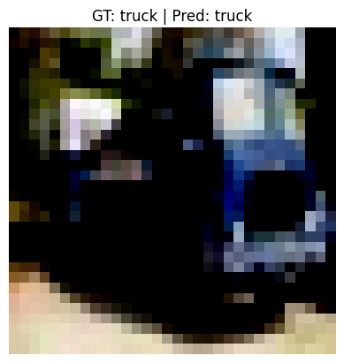  
  Logits: 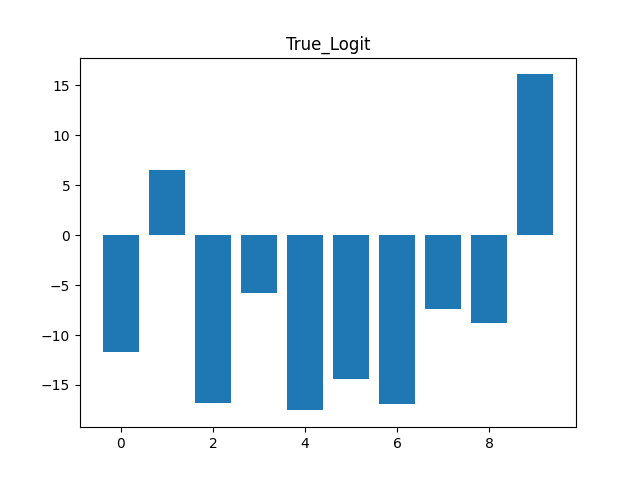  
  Softmax: 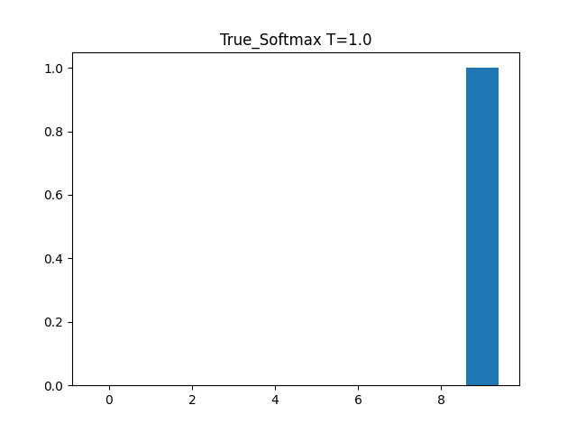

- **Model Predictions on FakeData Sample:**  
  Image: 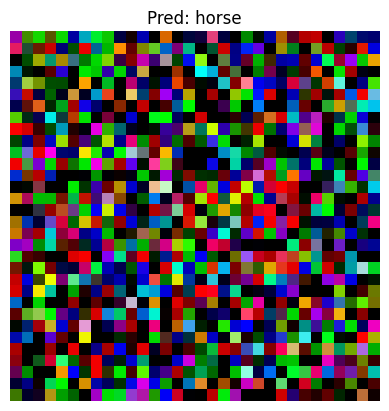  
  Logits: 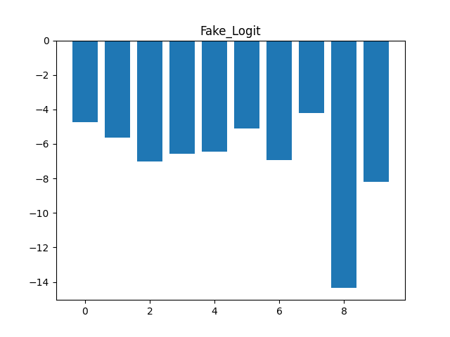  
  Softmax: 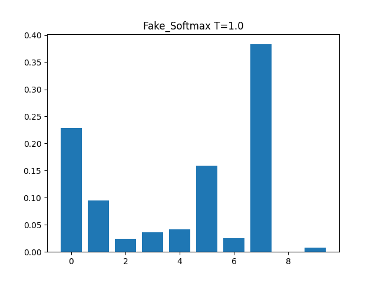

- **Dataset Distribution for CNN:**  
  Line Plot: 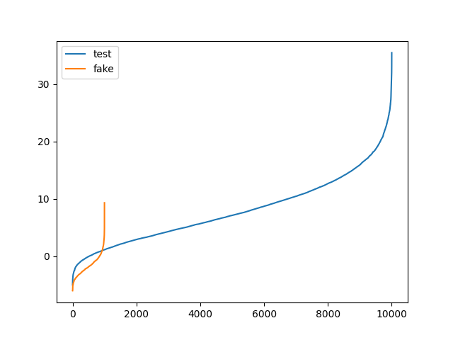  
  Histogram: 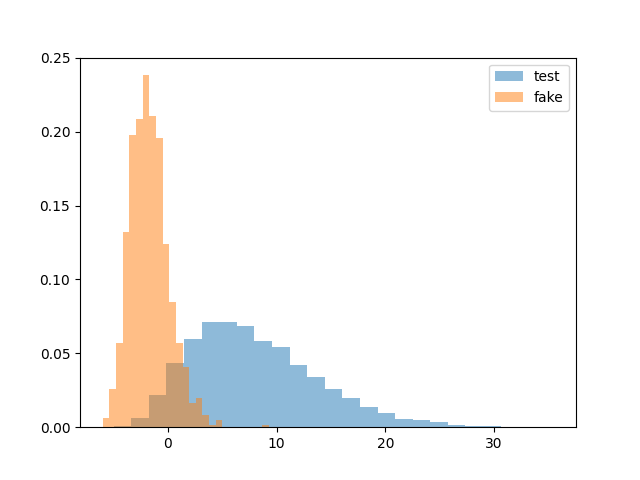

### 2. OOD Detection and Performance Evaluation Using Autoencoder
- Dataset Distribution:  
  Line Plot: 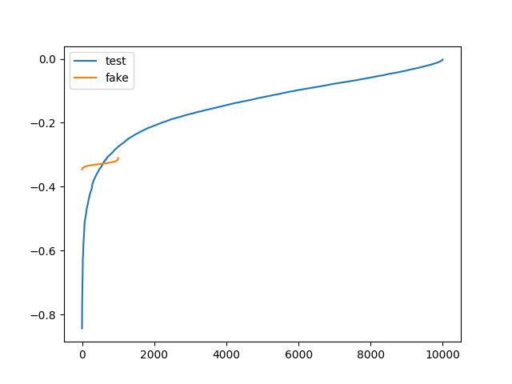  
  Histogram: 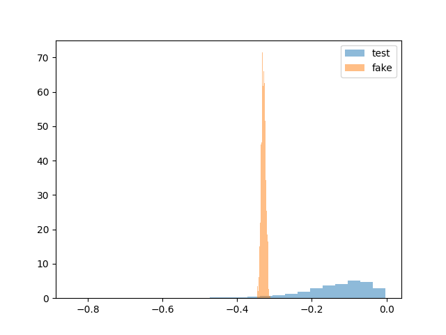

### 3. OOD Detection Metrics for CNN & Autoencoder
- **CNN Precision-Recall and ROC Curves:**  
  Precision-Recall: 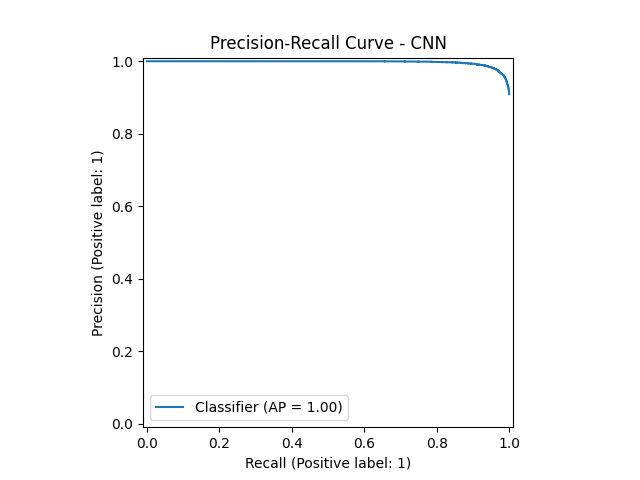  
  ROC Curve: 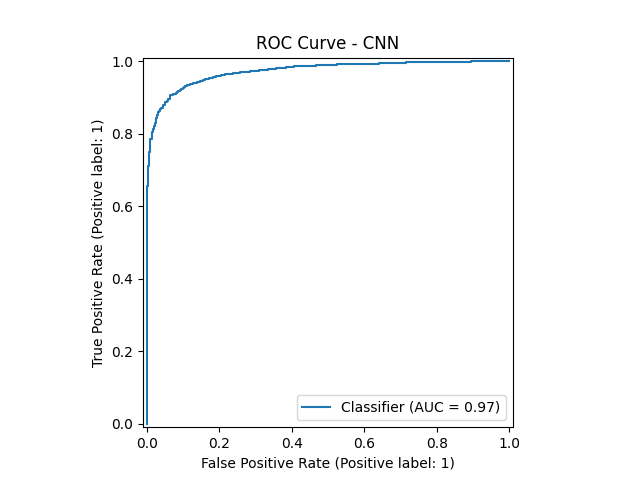

- **Autoencoder Precision-Recall and ROC Curves:**  
  Precision-Recall: 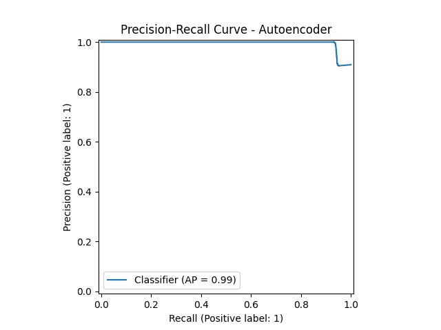  
  ROC Curve: 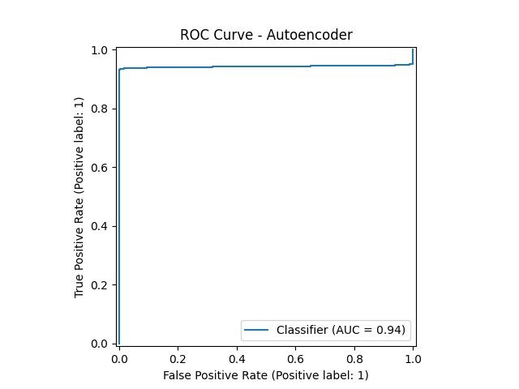

### 4. Enhancing Robustness to Adversarial Attacks

- **Fast Gradient Sign Method (FGSM):**  
  Perturbs samples in direction of input gradient:  
  \[
    \boldsymbol{\eta}(\mathbf{x}) = \varepsilon \mathrm{sign}(\nabla_{\mathbf{x}} \mathcal{L}(\boldsymbol{\theta}, \mathbf{x}, y))
  \]
  where \(\varepsilon\) is the attack budget controlling perturbation magnitude.

#### Untargeted FGSM Attack - Baseline
- Original image:   
- Perturbation: 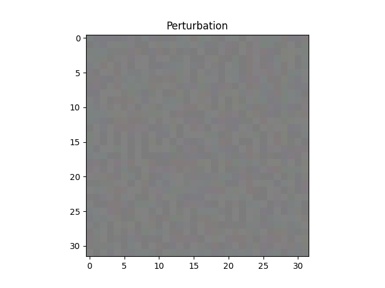  
- Perturbation scale: 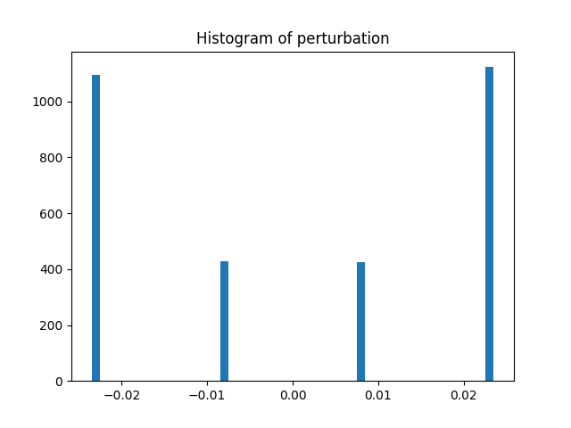  
- Adversarial image:   

> **Note:** Attack budget \(\varepsilon = \frac{6}{255}\)

#### Untargeted FGSM Attack after Adversarial Training
- Original image:   
- Perturbation: 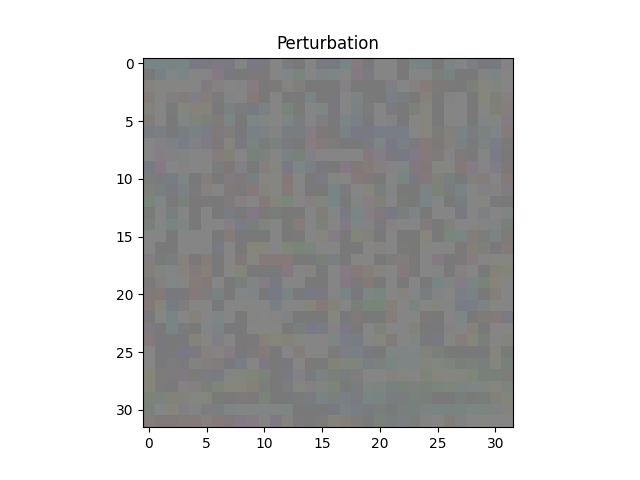  
- Perturbation scale: 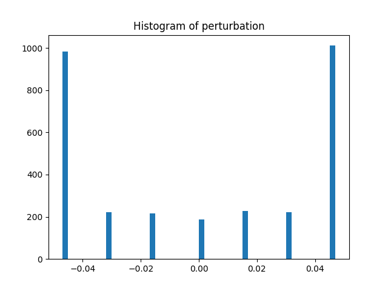  
- Adversarial image: 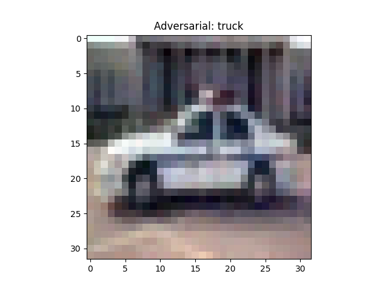  

> **Note:** Increased attack budget \(\varepsilon = \frac{12}{255}\)

#### Untargeted Attack Success Rates
\[
\text{Untargeted Attack Success Rate} = \frac{\# \text{ adversarial samples classified differently from ground truth}}{\text{total adversarial samples}} \times 100
\]

| Metric                          | Value (%) |
| -------------------------------|-----------|
| Untargeted Attack Success Rate  | 75.68     |
| Untargeted Attack Success Rate Robust | 33.14     |

#### Targeted Adversarial Training

- **Baseline Targeted FGSM Attack - Class Cat (used for robust training):**  
  Original:   
  Perturbation: 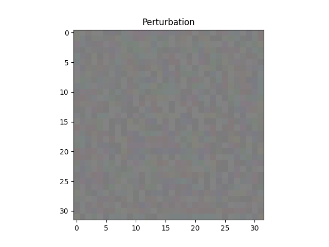  
  Perturbation scale: 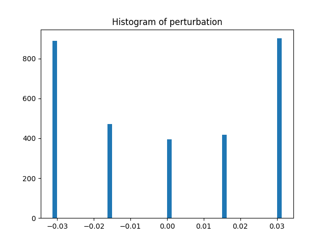  
  Adversarial:   

> **Note:** Attack budget \(\varepsilon = \frac{8}{255}\)

- **Baseline Targeted FGSM Attack - Class Horse (different from trained class):**  
  Original:   
  Perturbation: 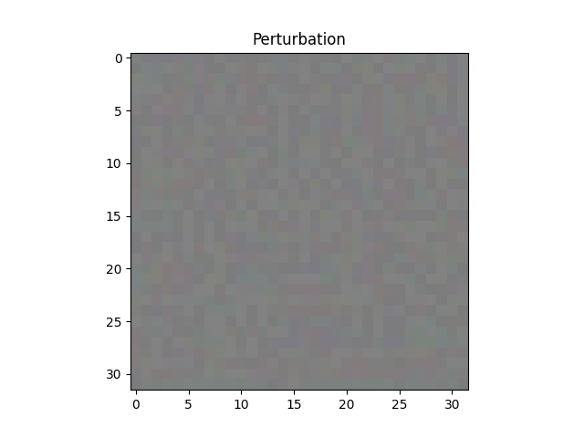  
  Perturbation scale: 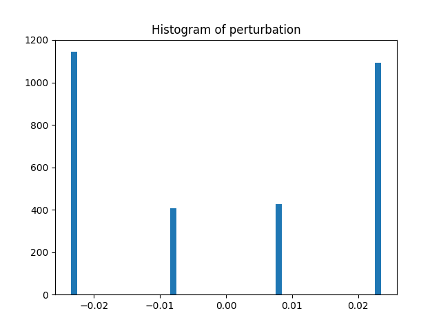  
  Adversarial:   

> **Note:** Attack budget \(\varepsilon = \frac{6}{255}\)

- **Targeted FGSM Attack on "cat" class after adversarial training on "cat":**  
  Original:   
  Perturbation: 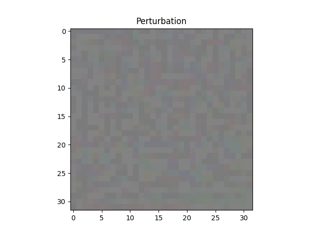  
  Perturbation scale: 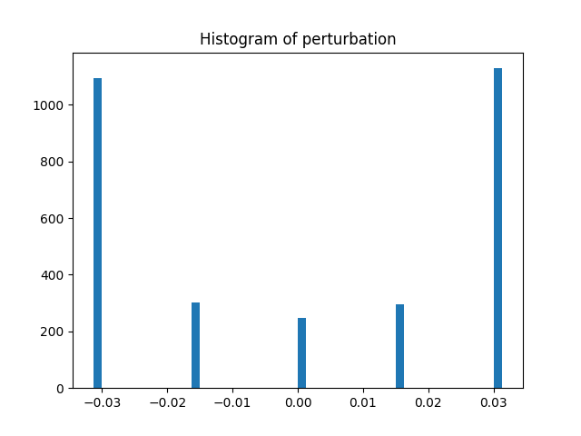  
  Adversarial:   

> **Note:** Same attack budget \(\varepsilon = \frac{8}{255}\) - effective?

- **Targeted FGSM Attack on "horse" class after training on "cat":**  
  Original:   
  Perturbation:   
  Perturbation scale:   
  Adversarial:   

> **Note:** Same attack budget \(\varepsilon = \frac{6}{255}\)

#### Targeted Attack Success Rates
\[
\text{Targeted Attack Success Rate} = \frac{\# \text{ adversarial samples classified as target class}}{\text{total adversarial samples}} \times 100
\]

| Class      | Success Rate Before Training (%) | Success Rate After Training (%) |
|------------|---------------------------------|--------------------------------|
| Airplane   | 31.84                           | 14.66                          |
| Automobile | 26.51                           | 15.27                          |
| Bird       | 52.16                           | 17.89                          |
| Cat        | 50.36                           | 13.92                          |
| Deer       | 36.55                           | 25.99                          |
| Dog        | 21.69                           | 24.21                          |
| Frog       | 17.51                           | 18.55                          |
| Horse      | 46.45                           | 16.91                          |
| Ship       | 26.37                           | 13.70                          |
| Truck      | 16.05                           | 12.49                          |

- Targeted training generally lowers the attack success rate, especially for cat and horse classes, while some classes like dog and frog show slight increases.

| Metric                         | Value (%) |
|--------------------------------|-----------|
| Untargeted Attack Success Rate  | 75.68     |
| Untargeted Attack Success Rate Robust | 33.14     |
| Targeted Attack Success Rate Robust | 41.26     |

## Output Folder Structure

```
output/
│
├── untargeted_baseline/
│   ├── original_image.png                     # Clean input
│   ├── adversarial_image_*_steps.png          # FGSM adversarial sample (untargeted, baseline)
│   ├── perturbation_image_*_steps.png         # Perturbation visualization added to image
│   ├── perturbation_histogram_*_steps.png     # Perturbation histogram
│
├── untargeted_trained_on_adv_sample/
│   ├── original_image.png                     # Clean input
│   ├── adversarial_image_*_steps.png          # Adversarial sample (untargeted, post-training)
│   ├── perturbation_image_*_steps.png         # Perturbation visualization added to image (post-training)
│   ├── perturbation_histogram_*_steps.png     # Perturbation histogram (post-training)
│
├── targeted_baseline_same_class/
│   ├── original_image.png                     # Clean input (car → cat)
│   ├── adversarial_image_*_steps.png          # FGSM adversarial sample (targeted, baseline)
│   ├── perturbation_image_*_steps.png         # Perturbation visualization added to image
│   ├── perturbation_histogram_*_steps.png     # Perturbation histogram
│
├── targeted_baseline_different_class/
│   ├── original_image.png                     # Clean input (car → horse)
│   ├── adversarial_image_*_steps.png          # FGSM adversarial sample (targeted, baseline)
│   ├── perturbation_image_*_steps.png         # Perturbation visualization added to image
│   ├── perturbation_histogram_*_steps.png     # Perturbation histogram
│
├── targeted_trained_same_different_class/
│   ├── original_image.png                     # Clean input (car → cat)
│   ├── adversarial_image_*_steps.png          # FGSM adversarial sample (targeted, post-training target cat)
│   ├── perturbation_image_*_steps.png         # Perturbation visualization added to image
│   ├── perturbation_histogram_*_steps.png     # Perturbation histogram
│
├── targeted_trained_baseline_different_class/
│   ├── original_image.png                     # Clean input (car → horse)
│   ├── adversarial_image_*_steps.png          # FGSM adversarial sample (targeted, post-training target cat)
│   ├── perturbation_image_*_steps.png         # Perturbation visualization added to image
│   ├── perturbation_histogram_*_steps.png     # Perturbation histogram
│
├── confusion_matrix.png                   # Confusion matrix for CNN
├── Fake_image_horse.png                   # Example fake image
├── Fake_Pred_horse.png                    # Example fake logits result
├── Fake_softmax_Pred_horse.png            # Example fake softmax scores
├── histogram_scores_CNN.png               # Dataset histogram distribution for CNN
├── histogram_scores_Autoencoder.png       # Dataset histogram distribution for Autoencoder
├── line_plot_scores_CNN.png               # Dataset line plot distribution for CNN 
├── line_plot_scores_Autoencoder.png       # Dataset line plot distribution for Autoencoder
├── precision_recall_curve_CNN.png         # CNN model precision-recall curve
├── precision_recall_curve_Autoencoder.png # Autoencoder precision-recall curve
├── roc_curve_CNN.png                      # CNN ROC curve
├── roc_curve_Autoencoder.png              # Autoencoder ROC curve
├── True_image_GT_truck_Pred_truck.png     # Example true image
├── True_logit_GT_truck_Pred_truck.png     # Example true logits result
├── True_softmax_GT_truck_Pred_truck.png   # Example true softmax scores

```

## How to Run

1. **Clone the repository:**

```

git clone https://github.com/lucrezio001/Deep-Leaning-Application-Luca-Capece.git
cd Deep-Leaning-Application-Luca-Capece/Lab4_OOD

```

2. **Install dependencies:**

```

pip install -r requirements.txt

```

3. **Training:**

- CNN and Autoencoder models are required before running `Lab4_OOD.py`.  
- Pretrained checkpoints are in the `Save` folder, with training logs available on [W&B](https://wandb.ai/lucacapece007-universit-di-firenze/Lab4_OOD?nw=nwuserlucacapece007).

- To train models from scratch:

```

python training_CNN.py

```

```

python training_Autoencoder.py

```

4. **Visualize Results:**

Run the main script:

```

python Lab4_OOD.py

```

All outputs and visualizations will be saved to the `output` folder following the structure above.

---

## References

- Liang, S., Li, Y., & Srikant, R. (2018). Enhancing The Reliability of Out-of-distribution Image Detection in Neural Networks. ICLR. [https://arxiv.org/abs/1706.02690](https://arxiv.org/abs/1706.02690)
- He, K., Zhang, X., Ren, S., & Sun, J. (2015). Deep Residual Learning for Image Recognition. [https://doi.org/10.48550/arXiv.1512.03385](https://doi.org/10.48550/arXiv.1512.03385)
```